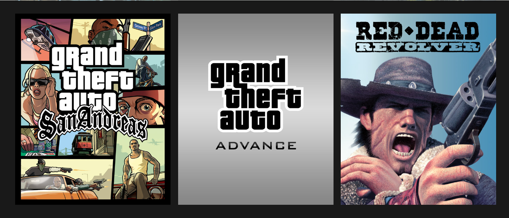

# Project README

This repository contains a team project where I, [Your Name], contributed by creating an HTML page with associated CSS for a specific section. The HTML and CSS files are organized within a folder named after me.

## Tags Used

1. **Semantic Tags:**
   - `<head>`: Used for metadata and included the `<title>` and `<link>` for favicon.
   - `<main>`: Utilized for the main content section.

2. **Non-Semantic Tags:**
   - `
`: Used for general grouping and styling.
   - ``: Employed for embedding images.
   - `<a>`: Utilized for creating hyperlinks.

## External Libraries

I incorporated the [AOS (Animate On Scroll) library](https://michalsnik.github.io/aos/) to add scroll-triggered animations to enhance the user experience.

## CSS Properties

1. **Background:**
   - `background-color`: Applied for setting the background color.

2. **Grid:**
   - Utilized the CSS Grid for arranging images in a row-wise fashion.

3. **Media Queries:**
   - Implemented media queries to ensure responsiveness for screen sizes.

## Screenshots

**Games page**

## Learning Experience

Through this project, I gained valuable insights into the following aspects:

1. **Semantic HTML Tags:** The use of semantic tags like `<main>` enhances the readability and accessibility of the code.

2. **AOS Library:** Integrating external libraries, such as AOS, can significantly contribute to the visual appeal of a webpage and provide a seamless user experience.

3. **Responsive Design:** Implementing media queries for different screen sizes is crucial for ensuring a consistent and user-friendly interface across various devices.

4. **CSS Grid:** Utilizing CSS Grid for layout design provides a flexible and efficient way to arrange elements on a webpage.

Overall, this project has enriched my understanding of web development practices and improved my skills in creating visually appealing and responsive user interfaces.
