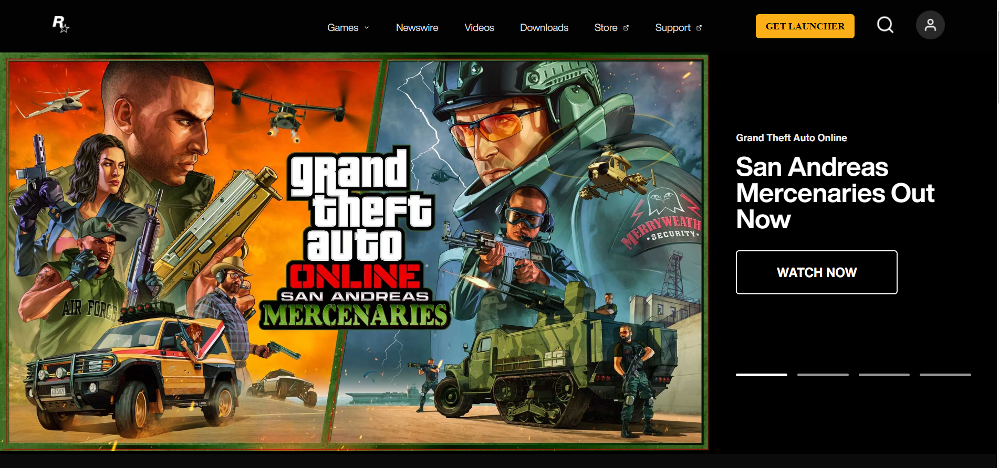
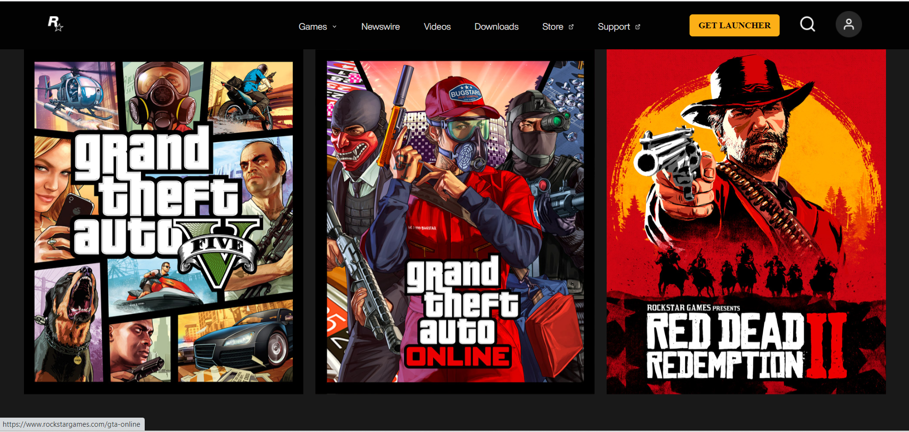
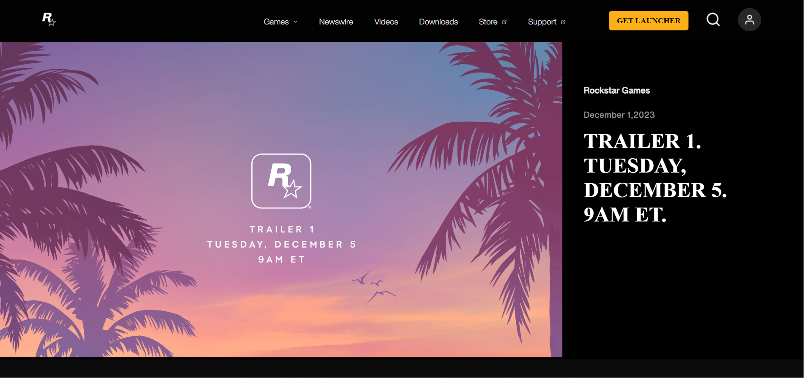
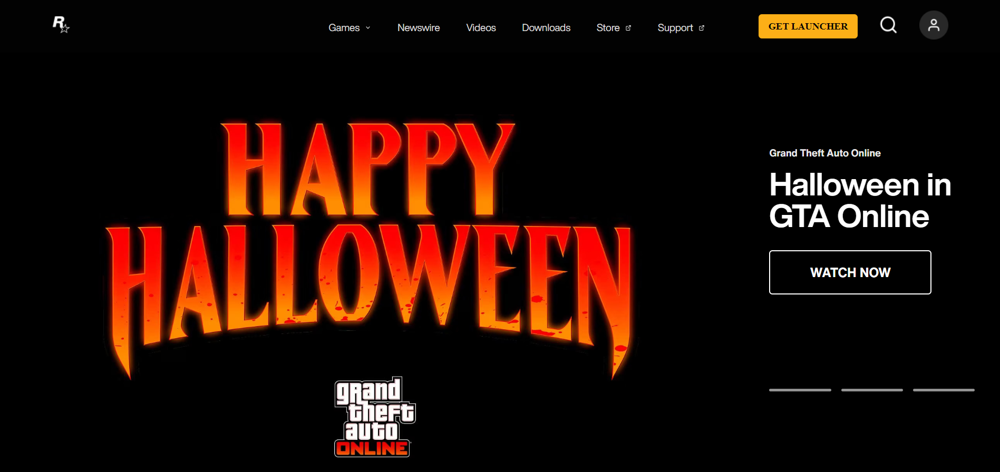
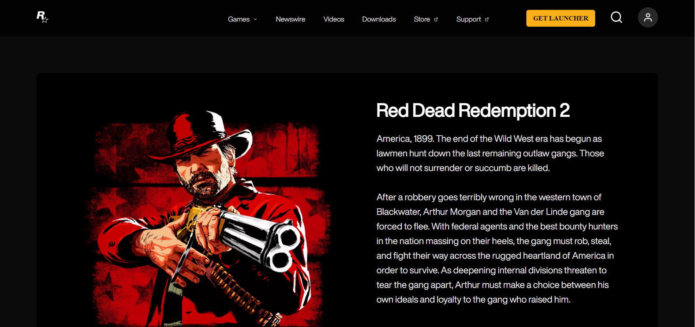
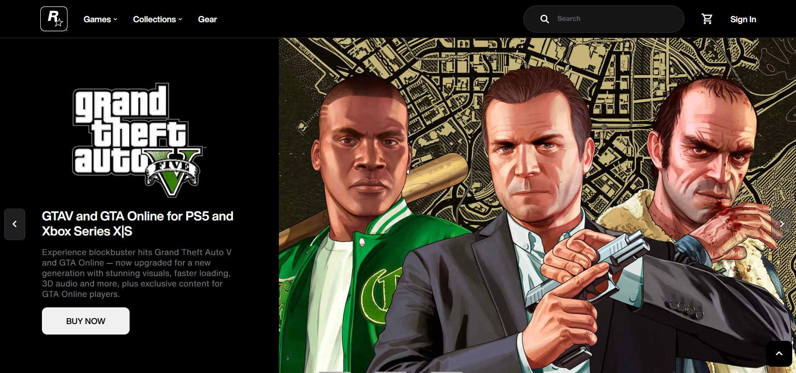
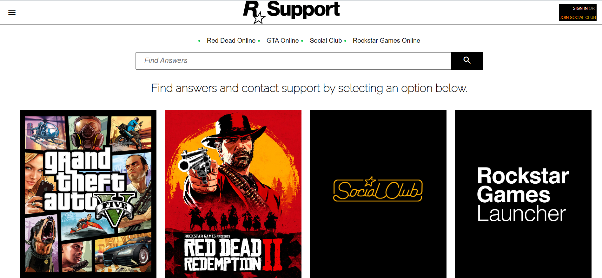
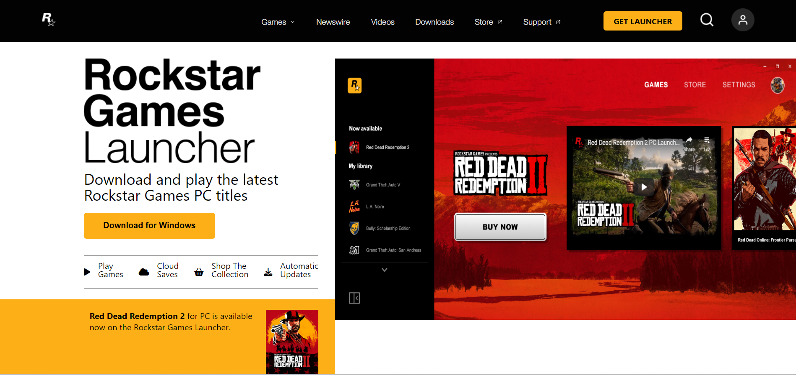
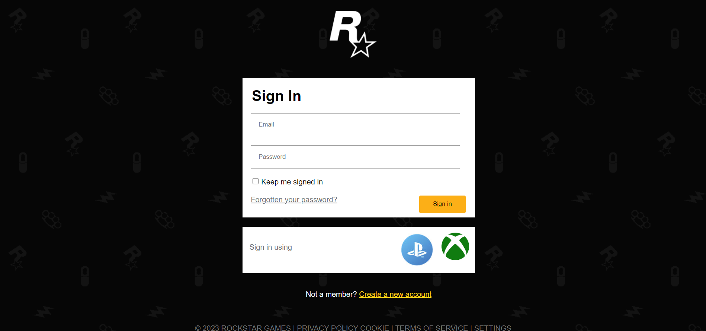
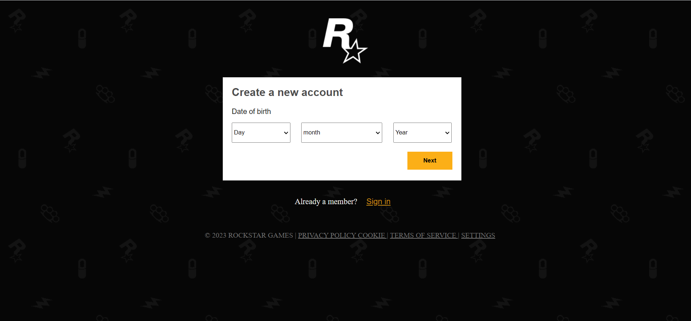

# Rockstar Games Site UI Clone

Welcome to our thrilling project developed as part of the Full Stack Development course with [Geekster](https://www.geekster.in/), where we're diving deep into the HTML and CSS module. We're proud to present our rendition of the Rockstar Games website UI and invite you to join us on this exciting journey!

## Hosted link

[Rockstar Games](https://jinu-vijayan.github.io/rockstar-games-site-clone/jinu/home/home.html)

## Technological Foundations:

- HTML (Markup Language)
- CSS (Style Sheet Language)
- JavaScript (Scripting Language)
- AOS Library for animations

## Development Stack:

- HTML and CSS for structuring and styling web content.
- JavaScript for dynamic and interactive functionality.
- AOS Library for captivating animations.

## Features to Explore:

1. **Modular Design:** Independently crafted Navbar and Footer modules for enhanced modularity and reusability.
2. **Dynamic Integration Magic:** Witness the dynamic integration of these modules into multiple pages using the JavaScript Fetch API.
3. **Responsive Design:** Marvel at the responsiveness of all pages, ensuring a seamless experience across devices of all shapes and sizes.
4. **Tech Note:** Please note a slight delay during the loading of components, a small quirk resulting from the asynchronous nature of Fetch API.

## Getting Started:

1. Clone the repository.
2. Navigate to the index.html file in the root directory and open it.
3. Open the `index.html` file in the browser
4. You'll initially see a "Go to site" link – clicking this link will reveal our Rockstar Games UI clone.
5. Alternatively, to go directly to the home page without clicking the "Go to site" link, open the folder named jinu and then open the `home.html` file in your browser.

Feel free to explore the UI clone using either method. Due to the organization of our project, each team member's contribution is housed in a separate folder named after them.

## Screen shots

**Home Page**

**Games Page**

**Newswire Page**

**Videos Page**

**Downloads Page**

**Store Page**

**Support Page**

**Get laucher Page**

**Sign in Page**

**Sign up Page**

## Credits

**Meet the Incredible Team:**

1. [Jinu](https://www.linkedin.com/in/jinu-vijayan-a3041b15a/)
2. [Deepak](https://www.linkedin.com/in/deepuroyal30?_l=en_US)
3. [Harshada](https://www.linkedin.com/in/harshada-patil-40b13a209/)
4. [Anil](https://www.linkedin.com/in/kundala-anil-kumar-92052a1ba/)
5. [Divyanshu](https://www.linkedin.com/in/divyanshu-pande-3a0434245/)
6. [Pratik](https://www.linkedin.com/in/pratik-magar-6b09782a3/)

**Mentor Extraordinaire:**

- [Abhay Chauhan](https://www.linkedin.com/in/abhay-chauhan-1751a420b/) - A heartfelt thank you for being incredibly helpful and motivating throughout our project. Your guidance has been invaluable!

**Gratitude to Our Exceptional Instructors at Geekster:**

- [Akhil Sharma](https://www.linkedin.com/in/akhil-sh06/) - Thank you for your exceptional teaching and clear explanations that made learning enjoyable and accessible.
- [Ankit Singh](https://www.linkedin.com/in/asingh88029/) - Your guidance and effective communication have been instrumental in our understanding of the module.