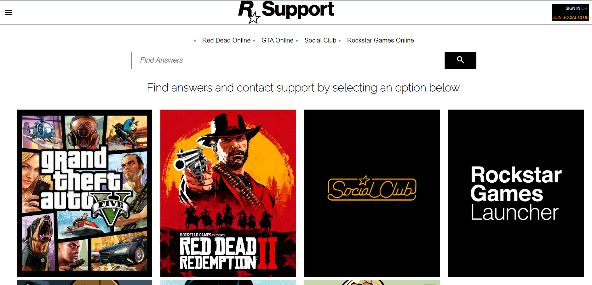
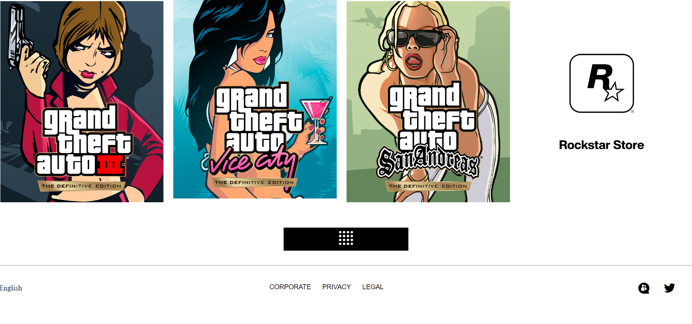

  ## TEAM ROCKSTAR GAMES:-

  1.Jinu vijayan(captain).
  2.Deepak.
  3.Harshada patil.
  4.Anil kumar.
  5.Divuyanshu pande.
  6.Pratik Magar.

## THIS NEWSWIRE AND SUPPORT PAGES ARE DESIGNED BY ME(DEEPAK).

## First Page:

# Rockstar Games Newswire

This is a simple HTML document for a fictional Rockstar Games Newswire website. The website showcases a main video trailer for Grand Theft Auto VI along with several news articles related to GTA Online, Rockstar Games, and Red Dead Online.

## File Structure:

- **index.html**: The main HTML file containing the structure of the webpage.
- **newswire.css**: The stylesheet file for styling the webpage.
- **assests/**: Directory containing images and video files used in the webpage.
- **harshada/navbar.js**: JavaScript file for handling the navigation bar.
- **divyanshu/footer/footer.js**: JavaScript file for handling the footer.
- **README.md**: Documentation file for the project.

## HTML Structure:

- **Head Section**:
  - Meta tags for character set and viewport configuration.
  - Title tag for the webpage.
  - Favicon link.
  - Stylesheet links for custom styles and external libraries.
  
- **Body Section**:
  - Navigation bar.
  - Main content divided into sections.
  - Video player for the main trailer.
  - News articles organized in a grid layout.
  - "More Stories" button for additional content.
  - Footer section.

# Rockstar Games Newswire

Welcome to the Rockstar Games Newswire, your ultimate source for the latest updates, trailers, and stories from the gaming universe. Dive into the action-packed world of Rockstar Games with our visually stunning website.

## 🚀 Features

### Trailer Premiere
Witness the thrill! The main section features the exclusive premiere of the Grand Theft Auto VI trailer. Set the date: **Tuesday, December 5, 9 AM ET**. Don't miss the excitement!

### Latest Stories
Explore the dynamic grid of news articles, each accompanied by eye-catching visuals:
- **New GTA Online Update Coming this December**
- **2X GTA$ and RP on Project Overthrow Missions**
- **New Rockstar Games Gear Now Available**
- ...and much more!

### Visual Appeal
Immerse yourself in our captivating design, enhanced with smooth animations using [AOS](https://michalsnik.github.io/aos/). Scroll through the content, and experience a seamless journey.

### Multimedia Experience
Enjoy an engaging video experience with our autoplay feature. Watch the GTA VI trailer in high definition, and let the excitement unfold.

### Navigation and Footer
Smoothly navigate through our user-friendly interface, complemented by a responsive navbar. Reach out to additional resources with our informative footer.

## JavaScript:
- Two external JavaScript files:
  - **harshada/navbar.js**: Handles the navigation bar.
  - **divyanshu/footer/footer.js**: Handles the footer.

## External Libraries:
- [AOS (Animate On Scroll)](https://michalsnik.github.io/aos/): Used for animating elements on scroll.

## Second Page:

# Rockstar Games Customer Support

Welcome to the Rockstar Games Customer Support website! This HTML project provides a visually appealing and user-friendly interface for users seeking assistance with Rockstar Games products. Here's a detailed overview of the project:

## 🚀 Features

### Navigation Bar
- A responsive navigation bar with a menu icon for a seamless user experience.
- Attractive Rockstar Games logo for brand recognition.
- "SIGN IN" and "JOIN SOCIAL CLUB" links for user authentication.

### Services Menu
- Quick access to major services, including Red Dead Online, GTA Online, Social Club, and Rockstar Games Online.

### Search Bar
- A search bar with an animated search icon for easy navigation and finding answers.

### Support Header
- A clear heading guiding users to find answers and contact support.

### Support Grid
- A visually appealing grid layout featuring support cards with images.
- Each card represents a different support option.

### Show All Button
- A stylish "Show All" button with an animated icon for users to explore more support options.

### Footer
- Language selection with an icon.
- Links to corporate, privacy, and legal information.
- Social media icons for Twitter support.

## 🎨 Styling
- Utilizes Google Fonts (Raleway) for a modern and clean typography style.
- Animated elements using Animate.css for a smooth and engaging user interface.

## File Structure

- **index.html**: The main HTML file containing the structure of the webpage.
- **support.css**: The stylesheet file for styling the webpage.
- **Images**: Directory containing images used in the webpage.
- **README.md**: Documentation file for the project.

## External Libraries

- [Animate.css](https://cdnjs.cloudflare.com/ajax/libs/animate.css/4.1.1/animate.min.css): Used for adding animations to elements.
- [Font Awesome](https://cdnjs.cloudflare.com/ajax/libs/font-awesome/6.5.1/css/all.min.css): Provides scalable vector icons that can be customized.

## How to Run

1. Clone the repository.
2. Open the `index.html` file in your preferred web browser.
3. Explore the Rockstar Games Customer Support interface and find the assistance you need!

Feel free to customize and enhance this template for your own creative projects. If you have any questions or need support, reach out through our social media channels. Happy gaming! 🎮🚀