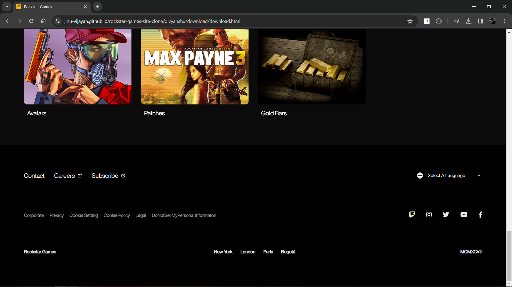

# Rockstar Games Site UI Clone

## Pages Overview

### `download.html`

The `download.html` page gives users an immense experience by allowing users to download and play games on their devices. 

### Its Features are:

- **Download Feature:** It allows to download games on multiple devices like Desktop and laptop( PC, and MAC ) as well as mobile devices( ISO, Andriod, Windows Phone, and Kindle )

- **Miscellaneous Feature:** It gathers different items such as music, game art, rock art, patches, etc. to be downloaded externally with download the games so the user can use it outside games to make a video or content.

-  **Fully Responsive:** All pages are designed to provide a seamless experience across various devices.

-  **Scroll Animations:** Applied animations to the home page using the AOS Library, triggering effects as you scroll.

## Technologies Used

- **💻 HTML:** Structuring the project's UI for optimal display.

- **🎨 CSS:** Styling elements to create a responsive interface.

- **🚀 JavaScript:** Implementing dynamic functionality, including animation using Animated On Scroll Library [AOS Library](https://github.com/michalsnik/aos)

- **Semantic Tags:**
  - `<main>`
  - `<section>`

- **Non-Semantic Tags:**
  - `
`
  - `<button>`
  - `
`
  - `<h2>`
  - ` `
  - ``
  - `<select>`
  - `<option>`
  - `<script>`

 ### `footer.html`

 The `footer.html` page is the section of every page inside the RockstarGames site and it plays a major role as it comprises links to their terms and policies and their social media. 
 
 ### Its Features are:

 -  **Fully Responsive:** All pages are designed to provide a seamless experience across various devices.
 -  **Links Pages:** Links to all the valuable information about the company and its policies.
 
 ## Technologies Used
 
- **💻 HTML:** Structuring the project's UI for optimal display.

- **🎨 CSS:** Styling elements to create a responsive interface.

- **Semantic Tags:**
  - `<footer>`

- **Non-Semantic Tags:**
  - `
`
  - `<ul>`
  - `<li>`
  - `<a>`
  - `<i>`
  - ``
  - `<select>`
  - `<option>`

  ### External Libraries

-  [Font Awesome](https://fontawesome.com/) for icons
-  [Google Material Icons](https://material.io/resources/icons/) for additional icons

## Learning and Insights

#### Animations with AOS Library:

- Used animations to make the user experience more engaging.

#### Responsive Web Design:

- Made sure websites work well on all devices.

#### Browser Tools for Debugging:

- Used browser tools to find and fix issues in the code.

#### Relative Units for Responsive Pages:

- Used relative units to ensure pages look good on different screen sizes.

#### Insights into Front-end Development:

- Learned a lot about how front-end development works.

#### Clean Code with HTML, CSS, and JavaScript:

- Emphasized writing organized and clear code for interactive and appealing websites.

#### GitHub Learning:

- Learned how to use GitHub for collaboration in tech projects.

#### Milestone in Web Development Journey:

- Reached an important point in becoming skilled in front-end technologies.

#### Building Confidence as a Web Developer:

- Gained confidence in web development skills.

## Screenshot

**Download Page**

**Footer Page**

