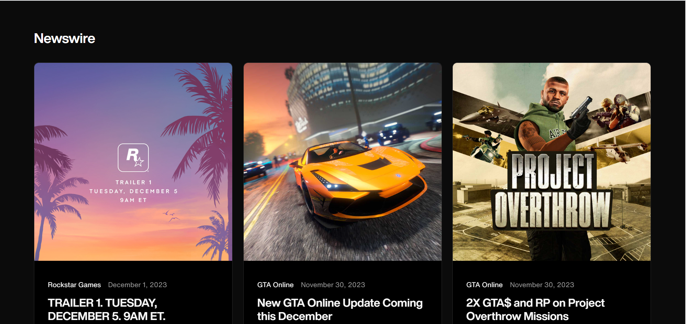
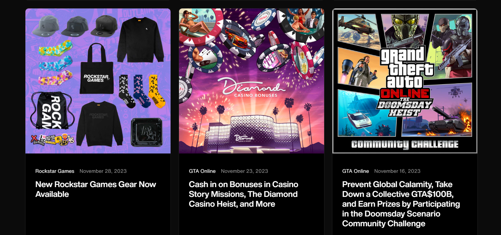
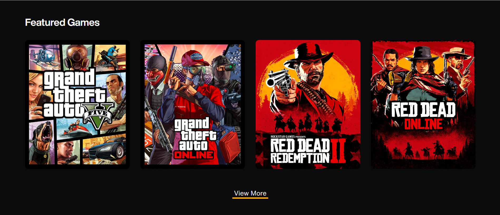
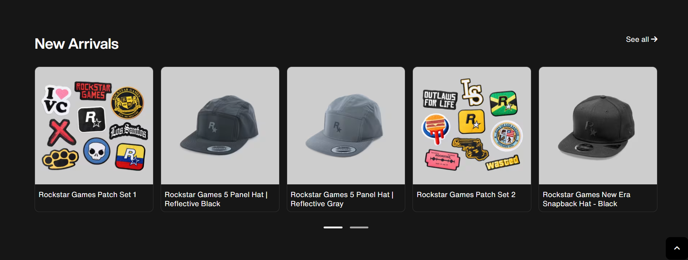
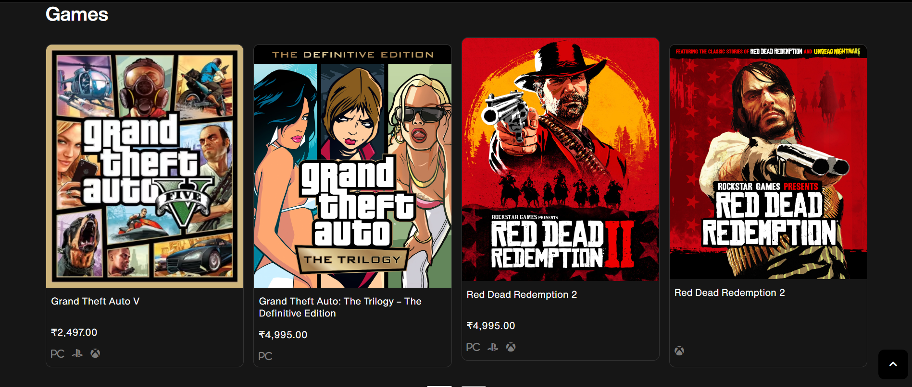
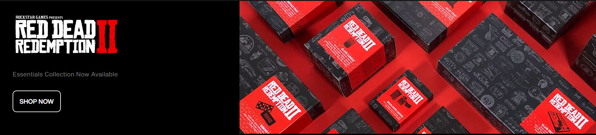
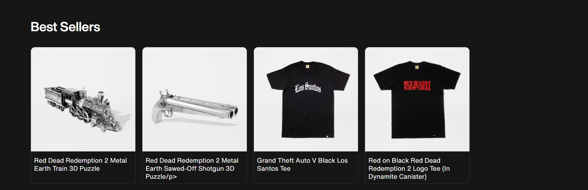
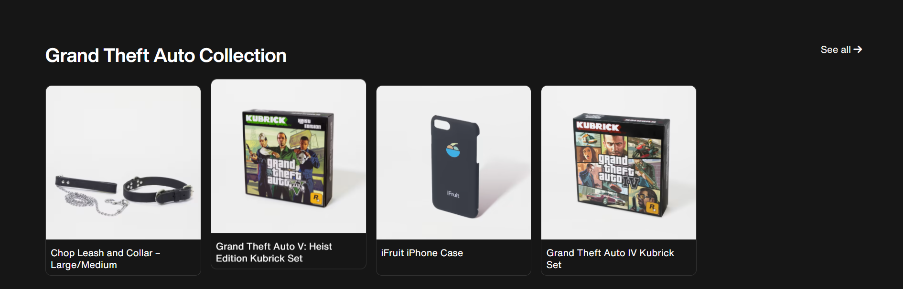
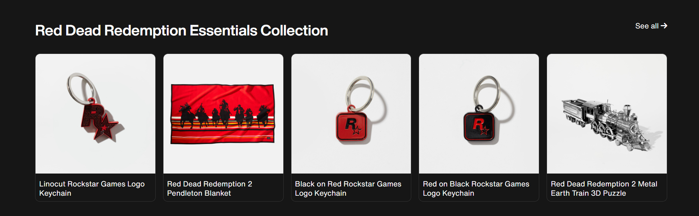
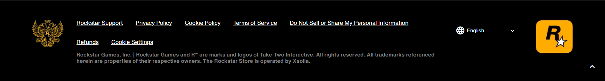

# Rockstar Games Site UI Clone

## Pages Overview

### `home.html`

The `home.html` page serves as the main landing page for the Rockstar Games UI. It features:

- 📰 **Newswire Highlights:** Displays a preview of highlights from the Newswire page with a "View More" button leading to the full page.
  
- 🎮 **Featured Games:** Showcases featured games from Rockstar Games with a "View More" button leading to the Featured Games page.

#### HTML Tags Used

- **Semantic Tags:**
  - `<main>`
  - `<section>`

- **Non Semantic Tags:**
  - `
`
  - `<button>`
  - `<h1>`
  - `
`
  - `<h2>`
  - ``
  - `<a>`
  - `<h3>`
  - ``
  - `<script>`

#### External Packages

- 🎭 [AOS Library](https://github.com/michalsnik/aos) for animations

### `store.html`

The `store.html` page is where users can go to purchase items related to the games produced by Rockstar Games. Notably, this page features a separate navbar and footer,since the navbar and footer for this page is different from the other pages.

#### HTML Tags Used

- **Semantic Tags:**
  - `<main>`
  - `<nav>`
  - `<header>`
  - `<footer>`

- **Non Semantic Tags:**
  - `
`
  - ``
  - `<i>` (used for icons)
  - `<form>`
  - `<select>`
  - `<option>`
  - `
`
  - `<ul>`
  - `<li>`
  - `<h2>`
  - `<button>`
  - `<script>`

#### External Libraries

- 🔍 [Font Awesome](https://fontawesome.com/) for icons
- 🔍 [Google Material Icons](https://material.io/resources/icons/) for additional icons

## Technologies Used

- 💻 HTML (Markup Language)
- 🎨 CSS (Style Sheet Language)
- 🚀 JavaScript (Scripting Language) - Dynamically loading navbar and footer
- 🎭 AOS Library for animations

## Development Stack

- 🚀 JavaScript for dynamic functionality.
- 🌐 HTML and 🎨 CSS for structuring and styling web content.
- 🎭 AOS Library for captivating animations.

## Features

- 📱 **Fully Responsive:** All pages are designed to provide a seamless experience across various devices.

- 🚀 **Scroll Animations:** Applied animations to the home page using the AOS Library, triggering effects as you scroll.

## Learning and Insights

- 🚀 **Animation with AOS Library:** Learned to enhance user experience by incorporating animations using the AOS Library.

- 🌐 **Responsive Design:** Gained expertise in making web pages fully responsive for a seamless user experience across various devices.

- 🔧 **Browser Dev Tools:** Improved proficiency in utilizing browser developer tools for better debugging and optimization.

- 📏 **Relative Units:** Recognized the importance of using relative units for creating responsive web pages.

## Screenshots

**Home Page:**

**Store Page:**

